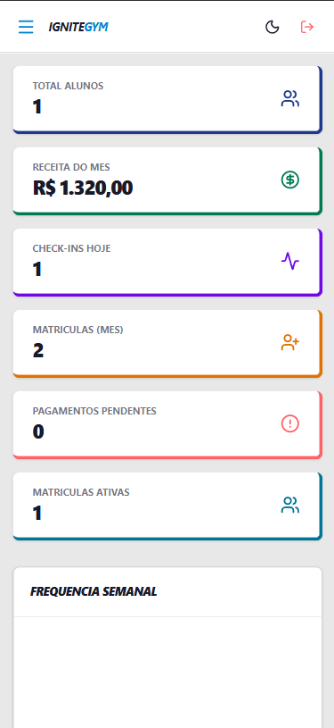
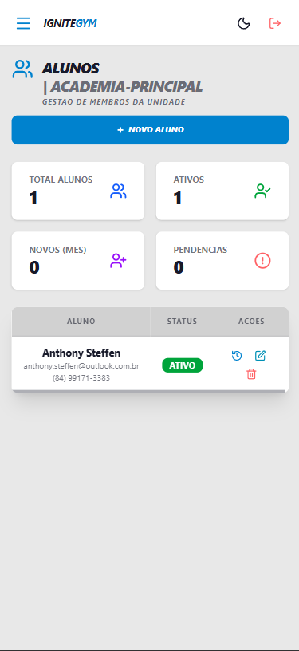
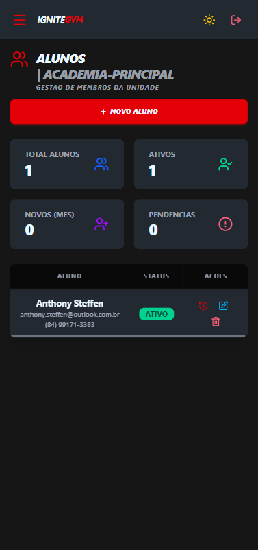

# IgniteGym

Plataforma SaaS para gestao de academias com arquitetura multi-tenant.

## Producao

- Web app (Railway): [https://ignitegym-front-end-production.up.railway.app/](https://ignitegym-front-end-production.up.railway.app/)

## Screenshots reais da aplicacao

As imagens abaixo sao capturas reais da aplicacao no estado atual do projeto.

### Login


### Dashboard (mobile)



### Alunos (light x dark)

| Modo light | Modo dark |
| --- | --- |
|  |  |

## Objetivo do produto

IgniteGym foi construida para operar o fluxo principal de uma academia:

- autenticacao e isolamento por unidade (tenant)
- alunos e planos
- matriculas e status de pagamento
- check-in
- fornecedores, produtos e estoque
- vendas (PDV)
- dashboard operacional com metricas da unidade

## Arquitetura

```text
IgniteGym/
|- backend/         API Node.js + TypeScript + Sequelize + MySQL
|- frontend-web/    SPA React + Vite + React Query + DaisyUI
|- e2e-tools/       Suite E2E (Playwright)
|- frontend-mobile/ Base mobile (em evolucao)
|- docker-compose.yml
```

### Multi-tenancy

- cada requisicao de dominio usa `/:slug/...`
- o `tenantTranslate` resolve o slug para `tenantId`
- consultas sao filtradas por `tenant_id`
- roles e permissoes sao aplicadas por middleware

## Stack tecnico

### Backend

- Node.js
- TypeScript
- Express
- Sequelize ORM
- MySQL 8
- JWT (auth)

### Frontend

- React 19
- Vite
- TypeScript
- TanStack React Query
- DaisyUI + Tailwind CSS
- Axios

### Qualidade

- E2E com Playwright (fluxo completo de negocio)
- Typecheck com `tsc --noEmit`

## Requisitos locais

- Node.js 20+ (recomendado)
- npm
- Docker Desktop (para stack dockerizada)

## Execucao local (Docker)

1. Subir containers:

```bash
docker-compose up -d
```

2. Frontend web:

```bash
cd frontend-web
npm install
npm run dev
```

3. A API sobe no container `ignitegym_api` (porta `3001`).

### Porta do MySQL no host

No `docker-compose`, o banco e publicado em `127.0.0.1:3307` por padrao para evitar conflito com `3306` local.

Para trocar:

```bash
MYSQL_HOST_PORT=3308 docker-compose up -d
```

PowerShell:

```powershell
$env:MYSQL_HOST_PORT=3308
docker-compose up -d
```

## Execucao local (sem Docker para API)

Se quiser rodar a API localmente usando o banco do container:

1. Ajuste `backend/.env`:

```env
DB_HOST=127.0.0.1
DB_PORT=3307
```

2. Execute:

```bash
cd backend
npm install
npm run db:migrate
npm run dev
```

## Testes E2E

Suite ponta a ponta em `e2e-tools/` cobrindo:

- registro de unidade
- login
- planos
- alunos
- matriculas
- check-in
- fornecedores
- produtos
- vendas
- logout
- validacao de receita no dashboard

Execucao:

```bash
cd e2e-tools
npm install
npm run e2e
```

Relatorios e screenshots:

```text
e2e-tools/artifacts/e2e-<timestamp>/
```

## Scripts principais

### Backend

```bash
npm run dev
npm run db:migrate
npm run db:seed
npm run build
```

### Frontend web

```bash
npm run dev
npm run build
npm run preview
```

## Observacoes de deploy

- Frontend em Railway (URL acima)
- Backend preparado para ambiente docker e variaveis de ambiente
- CORS configurado para ambiente local e producao

## Escopo atual (MVP operacional)

### Core obrigatorio

- tenant/unidade
- login e permissoes
- alunos
- planos
- matriculas
- check-in

### Core comercial

- status de pagamento da matricula
- dashboard por unidade
- historico do aluno

### Modulos secundarios

- fornecedores
- produtos/estoque
- vendas/PDV
- funcionarios

## Contribuicao

1. Crie uma branch
2. Commit por bloco funcional
3. Abra PR com descricao objetiva
4. Inclua evidencias de teste (typecheck e E2E quando aplicavel)

## Licenca

Uso interno e portfolio tecnico.
